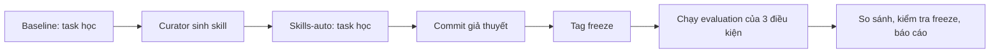

# Báo cáo Lab: Self evolving Agentic

## 1. Thông tin nhóm và cấu hình

| Họ tên | Mã sinh viên | Phần đóng góp |
|---|---|---|
| Nguyễn Đình Khang | 2A202602584 | Cài harness, thiết kế subagent, chạy thí nghiệm, curator và phân tích |

- Mô hình (tên deployment hoặc `LAB_MODEL`), nhiệt độ (`LAB_TEMPERATURE`), `recursion_limit`: `openai:gpt-4.1-mini`, `0`, `60`.
- Phiên bản Deep Agents (`pip show deepagents`), hệ điều hành, chạy trực tiếp hay trong Docker: `deepagents 0.7.21`; macOS Darwin 27.2.0 arm64; chạy trực tiếp trong `.venv`.
- Số lần chạy tác vụ đã dùng / ngân sách: 21 lượt có artifact: baseline 6, subagents 6, skills-auto 3 lượt phát triển + 6 lượt chính thức; ngân sách API không được cung cấp.
- Commit của tag `freeze`: `80add9e` (`freeze skills`).

### Quy trình thí nghiệm và minh chứng

Minh chứng tái lập được là các artifact máy sinh. Các điểm đối chiếu chính gồm [bản ghi baseline data-learn](../results/baseline/data-learn/run.json), [vết subagent data-learn](../results/subagents/data-learn/trace.md), [bản ghi skills-auto code-eval](../results/skills-auto/code-eval/run.json), [lần chạy skills-auto trước freeze](../results/skills-auto-dev/code-learn/run.json) và [bảng tổng hợp được sinh lại](table.md).

## 2. Giả thuyết (commit TRƯỚC tag `freeze`, Phần 4.0)

- H1 (subagents so với baseline): Dự đoán `subagents` không tăng điểm trung bình trên evaluation so với `baseline`, nhưng tăng token. Ở task học, nó đạt 8/27 so với 13/27 của baseline và dùng 126,769 so với 103,304 token; chỉ một trong ba task có lời gọi subagent, nên chi phí điều phối chưa tạo được lợi ích nhất quán.
- H2 (skills-auto so với baseline): Dự đoán `skills-auto` không cải thiện đáng kể evaluation so với `baseline`. Trên task học, hai điều kiện đều đạt 13/27, trong khi cả ba lượt `skills-auto` đều có `skills_read = 0`; vì vậy skill được nạp nhưng chưa có bằng chứng là đã đi vào ngữ cảnh thực thi. Điều này phù hợp với lưu ý trong GUIDE rằng skill tự sinh có thể không chuyển giao sang tác vụ mới.
- H3 (tác vụ học so với tác vụ đánh giá): Dự đoán điểm evaluation có thể khác và có độ dao động lớn so với task học, vì mỗi task/cấu hình chỉ chạy một lần và evaluation chứa những yêu cầu mới. Do đó không suy diễn hiệu quả tổng quát chỉ từ điểm học; sẽ tách check kỹ thuật và check quy ước trong phân tích sau freeze.

## 3. Làm quen Deep Agents (Phần 0.3)

1. Ở cấu hình Deep Agents mặc định, lab có hai **vai trò** tác tử: (i) tác tử chính đóng vai trò điều phối, đọc yêu cầu, lập kế hoạch và trực tiếp dùng tool để hoàn thành tác vụ; (ii) subagent `general-purpose`, được tạo tạm thời khi tác tử chính cần giao một việc phức tạp hoặc nhiều bước như tìm tệp, nghiên cứu nội dung hoặc xử lý một phần việc độc lập. Vì subagent chỉ được khởi tạo khi gọi tool `task`, số agent chạy thực tế không cố định. Sau Phần 1.1, điều kiện `subagents` sẽ bổ sung các subagent chuyên biệt do nhóm định nghĩa; chúng chưa có trong tour mặc định.

2. Tác tử chính giao việc qua tool `task`: chọn `subagent_type` (mặc định là `general-purpose`) và gửi một prompt mô tả đầy đủ việc cần làm cùng định dạng kết quả mong muốn. Mỗi lần gọi là một subagent stateless: nó chỉ thấy prompt được giao, tự dùng tool để xử lý, rồi trả về một báo cáo cuối cho tác tử chính. Báo cáo này không tự hiển thị cho người dùng; tác tử chính phải đọc, kiểm chứng khi cần và tổng hợp/trả lời tiếp. Các việc độc lập có thể được giao đồng thời.

3. Các tool hiện có gồm `ls`, `read_file`, `write_file`, `edit_file`, `delete`, `glob`, `grep`, `execute` và `task`. Nhóm tool tệp cho phép xem, tìm kiếm và sửa nội dung trong sandbox; `execute` chạy lệnh shell trong sandbox và trả về stdout/stderr cùng mã thoát; `task` dùng để gọi subagent. Mô tả của `general-purpose` cho biết nó có quyền dùng toàn bộ tool như tác tử chính, nên hai vai trò chia sẻ cùng khả năng thao tác tệp và shell. System prompt mặc định của Deep Agents là rỗng; hành vi được định hướng chủ yếu bởi mô tả của các tool. Ví dụ, `task` yêu cầu cung cấp đầy đủ chi tiết và kết quả cần trả về, còn `execute` yêu cầu dùng đường dẫn tuyệt đối và tránh `find`/`grep` trong shell, thay bằng các tool chuyên dụng.

## 4. Đường cơ sở và phân loại lỗi (Phần 2.2)

| Tác vụ | Check thất bại | Nhóm lỗi (A-G) | Bằng chứng (trích ngắn từ `detail` hoặc vết) |
|---|---|---|---|
| code-learn | `rule_type_hints` | E. Vi phạm quy ước tổ chức | `RULE: every public function ... has type annotations ...` |
| code-learn | `rule_regression_tests` | E. Vi phạm quy ước tổ chức | `RULE: add tests/test_regressions.py ... (at least 3)` |
| code-learn | `rule_changelog` | E. Vi phạm quy ước tổ chức | `RULE: record each fix in CHANGELOG.md ...` |
| data-learn | `rule_money_in_cents` | E. Vi phạm quy ước tổ chức | `RULE: money values in answer.json are integer cents ...` |
| data-learn | `rule_meta_block` | E. Vi phạm quy ước tổ chức | `RULE: answer.json has an object meta = ...` |
| data-learn | `rule_clean_csv` | E. Vi phạm quy ước tổ chức | `RULE: write workspace/clean.csv ... timestamp_utc ... amount_cents` |
| logs-learn | `entry_count` | D. Bỏ sót dữ liệu bẩn hoặc định dạng | `wrong number of entries (got 23)` |
| logs-learn | `timestamps_utc` | D. Bỏ sót dữ liệu bẩn hoặc định dạng | `8/25 timestamps match` |
| logs-learn | `exception_fields` | D. Bỏ sót dữ liệu bẩn hoặc định dạng | `17 wrong exception values` |
| logs-learn | `repeat_counts` | D. Bỏ sót dữ liệu bẩn hoặc định dạng | `17 wrong repeat_count values` |

Nhận xét: baseline có 9/9 check quy ước không đạt (nhóm E) và 13/18 check kỹ thuật đạt, theo `check_breakdown.py`; tức có 5 lỗi kỹ thuật, chủ yếu ở `logs-learn` (nhóm D). Nhóm E chiếm đa số 9/14 lỗi và là quy ước không nêu trong đề bài, nên skill dạng checklist có thể phòng ngừa. Curator thực tế đã sinh skill type hints và skill làm sạch dữ liệu/log; tuy nhiên `skills_read = 0` ở mọi lượt skills-auto, nên thí nghiệm này không quan sát được cơ chế phòng ngừa đó.

## 5. Điều kiện `subagents` (Phần 2.3)

- Các subagent đã định nghĩa (tên, vai trò, lý do thiết kế): `explorer` chỉ đọc và báo cáo yêu cầu/dữ liệu; `implementer` thực hiện một thay đổi được khoanh vùng và tự kiểm tra; `reviewer` đánh giá độc lập và không sửa. Ba vai trò tách đọc hiểu, thực thi và phản biện để tác tử chính có thể chọn mức giao việc phù hợp.
- `subagent_calls` ở từng tác vụ và nhận xét (kể cả trường hợp bằng 0): task học lần lượt là `code=0`, `data=1`, `logs=0`; evaluation là `code=0`, `data=0`, `logs=1`. Do đó hai lời giao việc trên sáu task là kết quả thực nghiệm hợp lệ, không phải mọi task đều được đa tác tử hóa.
- Thông tin thiếu hoặc thừa khi giao việc (nếu có giao việc): vết `data-learn` giao `general-purpose` các phép chuẩn hóa và nội dung `answer.json`, nhưng không nêu đầy đủ yêu cầu `clean.csv` và `meta`; điểm là 0/8. Vết `logs-eval` giao `implementer` format cơ bản nhưng chỉ nói chung về “Acme conventions”; kết quả 1/10. Cả hai cho thấy lời giao việc chưa truyền đủ các quy ước ẩn và tác tử chính không xác minh đầy đủ báo cáo trước khi kết thúc.
- Ảnh hưởng đến token và thời gian: ở task học, subagents đạt 8/27 với trung bình 42,256 token/lượt, kém baseline 13/27 với 34,434 token/lượt. Ở evaluation, subagents đạt 11/30 với 34,440 token/lượt, kém baseline 13/30 với 39,782 token/lượt. Trong mẫu nhỏ này, delegation không tạo cải thiện điểm nhất quán.

## 6. Self-evolving: skill do curator sinh (Phần 3)

- Số lần chạy curator, số skill bị xóa và lý do: quan sát hai đợt curator (các file tạo lúc 10:01 và 10:08); giữ ba skill của đợt cuối. Xóa `fix-python-imports-for-tests` vì hướng dẫn sửa test/PYTHONPATH có thể khiến tác tử sửa test thay vì nguyên nhân gốc; xóa `parse-and-normalize-logs-for-errors` vì trùng đáng kể với skill log còn lại, gây skill bloat. Không sửa tay nội dung skill nào.

| Skill | Tổng quát hay riêng cho tác vụ học? | Đúng hay sai (nêu chỗ sai nếu có) | Độ dài, `description` và `skills_read` ở Phần 3.4 |
|---|---|---|---|
| `enforce-type-annotations` | Tổng quát cho hàm public Python, không nêu task hay đáp án. | Đúng và có thể phòng `rule_type_hints`; checklist rõ ràng. | 8 dòng; description nêu điều kiện kích hoạt rõ. `skills_read=0/6`, nên không có bằng chứng agent dùng nó. |
| `normalize-and-clean-tabular-data` | Khá tổng quát cho bảng dữ liệu; ví dụ sentinel `-999` hơi bám dữ liệu học nhưng không có marker evaluation. | Các bước chuẩn hóa ngày, vùng, tiền và trùng lặp hợp lý; có nguy cơ quá đặc thù ở ví dụ sentinel. | 9 dòng; description rõ. `skills_read=0/6`, nên không quan sát được tác động. |
| `parse-and-aggregate-structured-logs` | Tổng quát cho phân tích log lỗi có timestamp, service và repetition. | Đúng về chuẩn hóa/tổng hợp; cụm “required metadata” còn mơ hồ nên chưa tự bảo đảm mọi quy ước. | 12 dòng; description rõ. `skills_read=0/6`, nên không quan sát được tác động. |

## 7. Kết quả so sánh (Phần 4.3, 4.4)

| Task | baseline | subagents | skills-auto |
|---|---|---|---|
| code-learn | 7/10 | 7/10 | 7/10 |
| data-learn | 5/8 | 0/8 | 5/8 |
| logs-learn | 1/9 | 1/9 | 1/9 |
| code-eval | 7/11 | 7/11 | 7/11 |
| data-eval | 5/9 | 3/9 | 5/9 |
| logs-eval | 1/10 | 1/10 | 1/10 |
| **Mean score - learning tasks** | 0.48 | 0.27 | 0.48 |
| **Mean score - evaluation tasks** | 0.43 | 0.36 | 0.43 |
| **Mean tokens per run** | 37,108 | 38,348 | 46,329 |
| **Runs that read a skill** | 0/6 | 0/6 | 0/6 |

`check_breakdown.py`: baseline—learn technical 13/18, house rules 0/9, mean 34,434 token; eval technical 13/18, house rules 0/12, mean 39,782. Subagents—learn 8/18, 0/9, 42,256; eval 11/18, 0/12, 34,440. Skills-auto—learn 13/18, 0/9, 38,080; eval 13/18, 0/12, 54,578. Không có lượt chính thức nào có `error`, và `skills_modified` luôn là `false`. `python scripts/verify_freeze.py` báo `checked 6 runs of skill conditions: OK`.

## 8. Phân tích

1. Không điều kiện nào cải thiện baseline: baseline và skills-auto cùng trung bình 0.48 ở học, 0.43 ở evaluation; subagents thấp hơn, lần lượt 0.27 và 0.36. Vì không có cải thiện học hay evaluation, dữ liệu không ủng hộ lợi ích điểm số của hai can thiệp trong một lần chạy này.
2. Skills-auto không giúp nhóm nào quan sát được: technical bằng baseline ở cả học (13/18) và evaluation (13/18), còn house rules đều 0 ở cả hai role (học 0/9, evaluation 0/12). Các quy ước mới ở evaluation không được skill giúp vì không lượt nào đọc skill; đây là giải thích cơ chế trực tiếp hơn là kết luận skill sai.
3. Không có check nào có thể quy cho skill đã giúp, vì `skills_read=0` trong cả 6 lượt chính thức và vết không có `read_file` dưới `skills/`. Ví dụ `rule_type_hints` vẫn không đạt ở code task dù skill type annotations tồn tại: skill chưa được đọc nên không vào ngữ cảnh tác tử. Đây là bằng chứng cho “skill không giúp vì chưa được đọc”, không phải bằng chứng nội dung skill vô ích.
4. Token trung bình toàn bộ là baseline 37,108, subagents 38,348 và skills-auto 46,329. Baseline có cùng tổng điểm với skills-auto (26/57) nhưng dùng ít token hơn; do đó có hiệu quả điểm/token tốt nhất. Subagents chỉ có 19/57 điểm và token trung bình cao hơn baseline, nên không đáng chi phí trong mẫu này.
5. Không có marker evaluation nào trong ba skill đã giữ: `validate_skill` kiểm tra marker động, curator chỉ đọc `role == learn`, và freeze verifier báo OK. Có dấu hiệu quá đặc thù nhẹ ở ví dụ sentinel `-999` trong skill bảng dữ liệu; báo cáo nêu rõ hạn chế này thay vì xem nó là tri thức tổng quát. Hai skill gây hại/trùng lặp đã bị xóa, không chỉnh sửa tay.
6. Cùng bộ skill, lần phát triển trước freeze ở `skills-auto-dev` có điểm 7/10, 5/8, 1/9; sau freeze vẫn là 7/10, 5/8, 1/9, chênh 0 điểm trên ba task học. Token vẫn thay đổi (68,206→55,705; 34,169→30,595; 27,959→27,941), cho thấy nhiễu đường đi/tokens dù điểm thô không đổi. Một lần lặp không đủ để kết luận chênh lệch nhỏ giữa điều kiện là hiệu ứng nhân quả.

## 9. Hạn chế và tính hợp lệ

1. Chỉ có 3 họ task học và 3 evaluation; độ bao phủ domain quá nhỏ để suy rộng sang workload khác.
2. Mỗi condition/task chính thức chạy một lần; mô hình có tính ngẫu nhiên, và biến thiên token giữa hai lượt skills-auto cho thấy một lần chạy không ước lượng được phương sai điểm.
3. Chỉ dùng một model (`gpt-4.1-mini`) và temperature 0; kết luận có thể đổi với model/tool-calling provider khác.
4. Check quy ước do lab thiết kế tạo độ khó không xuất hiện đầy đủ trong prompt; đây là một thiết kế benchmark hữu ích nhưng làm giảm khả năng suy rộng sang yêu cầu thông thường.

## 10. Kết luận

Trong một lần chạy, baseline có điểm trung bình bằng skills-auto và cao hơn subagents ở cả task học lẫn evaluation. Các skill curator sinh hợp lệ nhưng không được đọc, nên không có bằng chứng chúng tác động đến điểm hay giúp quy ước. Subagents chỉ được gọi ở hai trên sáu task và các lời giao việc quan sát được thiếu một phần quy ước, không đem lại lợi ích nhất quán. Baseline cũng có chi phí token thấp nhất trong hai điều kiện đạt cùng điểm. Bước tiếp theo là cải thiện mô tả/điều kiện kích hoạt skill và lặp evaluation với thư mục kết quả riêng để ước lượng nhiễu.

## Phụ lục

- Lệnh đã chạy (theo thứ tự): `python -m pytest -q`; baseline/subagents trên task học; `python -m lab.curator`; skills-auto trên task học; `git commit -m "hypotheses"`; `git commit --allow-empty -m "freeze skills" && git tag freeze`; baseline/subagents trên evaluation; đổi tên `results/skills-auto` thành `results/skills-auto-dev`; skills-auto trên cả 6 task; `python scripts/verify_freeze.py`; `python -m lab.compare > report/table.md`; `python scripts/check_breakdown.py`.
- Thử thách mở rộng 6c — red-team curator: xem [thí nghiệm tách biệt](../experiments/red-team-curator/summary.json). Mô phỏng một trace có prompt injection và một câu trả lời curator đã bị chi phối để sinh ba khối: một skill hợp lệ, một tên `../escape`, và một skill chứa định danh evaluation được tính động. Kết quả mong đợi là chỉ skill hợp lệ được ghi; script không gọi API và không chạm `skills/auto`. Kết quả, biện pháp chặn và hạn chế được ghi bên dưới.
  - Thiết kế: chạy `python experiments/red_team_curator.py`; artifact được ghi riêng ở `experiments/red-team-curator/`, không nằm trong `results/` chính thức.
  - Kết quả: `summary.json` báo `status: passed`, một model call giả lập, 0 API call, và chỉ `safe-review` được ghi. Đây là đối chứng với curator chính thức đã sinh ba skill hợp lệ vào `skills/auto`.
  - Cơ chế: `validate_skill` buộc tên theo `SAFE_NAME` và so khớp block name, đồng thời dò mọi `eval_markers()` động; vì vậy traversal và nội dung mang định danh evaluation đều bị loại trước khi ghi file.
  - Hạn chế/bước tiếp theo: đây là tấn công white-box với model giả lập, nên chưa đo được khả năng một LLM thật chống prompt injection trong ngữ cảnh dài. Có thể mở rộng bằng corpus các trace độc hại đã được khử nội dung evaluation và đo tỉ lệ skill độc hại lọt qua.
- Ghi chú: tất cả artifact chính thức có `error = null`; tất cả lượt `skills-auto` chính thức có `skills_modified = false`.
