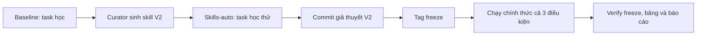

# Báo cáo Lab: Self evolving Agentic

## 1. Thông tin nhóm và cấu hình

| Họ tên | Mã sinh viên | Phần đóng góp |
|---|---|---|
| Nguyễn Đình Khang | 2A202602584 | Cài harness, định nghĩa subagent, curator, chạy và phân tích thí nghiệm V2 |

- Mô hình, nhiệt độ, `recursion_limit`: `openai:gpt-4.1-mini`, `0`, `60`.
- Môi trường: `deepagents 0.7.21`, macOS Darwin arm64, chạy trực tiếp trong `.venv`.
- Lượt chính thức V2: 18 lượt (6 baseline, 6 subagents, 6 skills-auto), ngoài ra có 1 lượt phát triển tại [results-v2-dev](../results-v2-dev/skills-auto/code-learn/run.json).
- Tag `freeze`: commit `2e0a549` (`freeze skills v2`). Tag `freeze-v1` giữ bản freeze cũ để truy vết.



Không có ảnh chụp màn hình; minh chứng tái lập được là các artifact máy sinh: [skill V2](../skills/auto/code-package-contract-audit/SKILL.md), [run code-eval](../results/skills-auto/code-eval/run.json), [trace logs-eval](../results/skills-auto/logs-eval/trace.md) và [bảng tổng hợp](table.md).

## 2. Giả thuyết (commit TRƯỚC tag `freeze`)

- H1 (subagents so với baseline): Dự đoán `subagents` không vượt `baseline` nhất quán ở evaluation. Ở học V2, hai điều kiện cùng đạt 8/27; `subagents` có hai lời gọi subagent nhưng không tạo thêm check đạt.
- H2 (skills-auto so với baseline): Dự đoán `skills-auto` cải thiện check quy ước của code, data và logs nhưng dùng nhiều token hơn. Lượt phát triển `code-learn` đọc đủ 3 skill, đạt 9/10 so với baseline 7/10; regression test và changelog đều đạt. Đây là dự đoán trước evaluation sau freeze.
- H3 (tác vụ học so với tác vụ đánh giá): Dự đoán điểm evaluation dao động so với task học vì evaluation có dữ liệu/quy ước mới và mỗi tổ hợp chỉ chạy một lần. Vì vậy cần tách check kỹ thuật/quy ước.

Giả thuyết được commit ở `5cdf6cb`; tag freeze được tạo sau đó ở `2e0a549`.

## 3. Làm quen Deep Agents (Phần 0.3)

1. Tác tử chính có `ls`, `read_file`, `write_file`, `edit_file`, `delete`, `glob`, `grep`, `execute` và `task`. `execute` chạy shell trong sandbox.
2. Coordinator gọi `task`, chọn `subagent_type` và gửi mô tả đầy đủ. Subagent `general-purpose` stateless, chỉ thấy lời giao việc, dùng tool tương tự tác tử chính và trả báo cáo để coordinator tự kiểm chứng.
3. System prompt mặc định của Deep Agents rỗng. Mô tả `task` yêu cầu nêu đủ chi tiết/kết quả mong muốn; `execute` mô tả việc chạy shell và trả stdout/stderr/mã thoát.

## 4. Đường cơ sở và phân loại lỗi

| Tác vụ | Check thất bại | Nhóm | Bằng chứng |
|---|---|---|---|
| code-learn | `rule_type_hints` | E | `RULE: every public function ... has type annotations` |
| code-learn | `rule_regression_tests` | E | `RULE: add tests/test_regressions.py ...` |
| code-learn | `rule_changelog` | E | `RULE: record each fix in CHANGELOG.md ...` |
| data-learn | `north_q1_revenue` | B | `FileNotFoundError ... answer.json` |
| data-learn | `north_q1_orders` | B | `FileNotFoundError ... answer.json` |
| data-learn | `top_region` | B | `FileNotFoundError ... answer.json` |
| data-learn | `missing_amount_orders` | B | `FileNotFoundError ... answer.json` |
| data-learn | `duplicate_rows_removed` | B | `FileNotFoundError ... answer.json` |
| data-learn | `rule_money_in_cents` | E | `FileNotFoundError ... answer.json` |
| data-learn | `rule_meta_block` | E | `FileNotFoundError ... answer.json` |
| data-learn | `rule_clean_csv` | E | `RULE: write workspace/clean.csv ... amount_cents` |
| logs-learn | `entry_count` | D | `wrong number of entries (got 22)` |
| logs-learn | `timestamps_utc` | D | `10/25 timestamps match` |
| logs-learn | `exception_fields` | D | `15 wrong exception values` |
| logs-learn | `repeat_counts` | D | `15 wrong repeat_count values` |
| logs-learn | `counts_by_service` | D | `counts_by_service: wrong values` |
| logs-learn | `rule_service_names` | E | `RULE: ... lower-case with '-' replaced by '_'` |
| logs-learn | `rule_sorted_errors` | E | `RULE: errors is sorted by service ...` |
| logs-learn | `rule_schema_header` | E | `RULE: schema_version: 2 ... generated_by: log-triage` |

Nhóm E chiếm 8/19 lỗi; D chiếm 5/19 và B chiếm 5/19. `check_breakdown.py` cho baseline-learning là 8/18 kỹ thuật và 0/9 house rules. Skill có thể phòng ngừa E bằng artifact/checklist rõ ràng, còn D cần hiểu parser và dữ liệu bẩn.

## 5. Điều kiện `subagents`

- `explorer` chỉ đọc/tóm tắt; `implementer` thực hiện thay đổi có giới hạn và tự kiểm tra; `reviewer` kiểm tra độc lập không sửa.
- `subagent_calls`: học `code=1`, `data=1`, `logs=0`; evaluation `code=0`, `data=1`, `logs=1`. Ví dụ [trace code-learn](../results/subagents/code-learn/trace.md) gọi `implementer`.
- Hai lời giao data nêu phép làm sạch/kết quả chính nhưng không truyền đủ house rules; coordinator không kiểm chứng artifact đến cùng. Điều này phù hợp data-learn 0/8 và data-eval 1/9.
- Token evaluation trung bình là 36,556, cao hơn baseline 23,004, trong khi điểm trung bình thấp hơn (0.28 so với 0.36). Delegation không đáng chi phí trong mẫu này.

## 6. Self-evolving: skill do curator sinh

- Curator V2 chạy 2 lần. Đợt đầu chỉ nói “verify/audit”, lượt thử vẫn bỏ artifact. Tôi xóa cả ba skill đợt đó, sửa prompt curator để yêu cầu tạo/cập nhật artifact, rồi chạy lại. Không sửa tay nội dung skill nào.

| Skill | Tổng quát và đúng đắn | Độ dài / kích hoạt / sử dụng |
|---|---|---|
| `code-package-contract-audit` | Tổng quát cho package Python; annotation, regression test, changelog và test suite; không có ID/đáp án evaluation. | 10 dòng; code đọc 3 skill ở learn/eval. |
| `tabular-data-cleaning-and-contract-audit` | Tổng quát cho dữ liệu bảng. Ví dụ sentinel `-999` là dấu hiệu overfit nhẹ. | 15 dòng; data đọc 2 skill ở learn/eval. |
| `log-file-parsing-and-contract-audit` | Tổng quát cho log triage: UTC, service, repeat count, sort, aggregate, metadata. | 14 dòng; logs đọc 1 skill ở learn/eval. |

Ba skill đều qua `validate_skill`, không chứa marker evaluation. Lượt phát triển [code-learn](../results-v2-dev/skills-auto/code-learn/run.json) đạt 9/10, `skills_read=3`; lượt chính thức 8/10: điểm vẫn có nhiễu dù skill hash không đổi.

## 7. Kết quả so sánh

Nội dung sinh bởi `python -m lab.compare > report/table.md`:

| Task | baseline | subagents | skills-auto |
|---|---|---|---|
| code-learn | 7/10 | 7/10 | 8/10 |
| data-learn | 0/8 | 0/8 | 5/8 |
| logs-learn | 1/9 | 1/9 | 3/9 |
| code-eval | 7/11 | 7/11 | 7/11 |
| data-eval | 3/9 | 1/9 | 5/9 |
| logs-eval | 1/10 | 1/10 | 3/10 |
| **Mean score - learning tasks** | 0.27 | 0.27 | 0.59 |
| **Mean score - evaluation tasks** | 0.36 | 0.28 | 0.50 |
| **Mean tokens per run** | 94,717 | 38,546 | 81,594 |
| **Runs that read a skill** | 0/6 | 0/6 | 6/6 |

```text
condition     role    technical  house rules  mean tokens  read a skill
baseline      eval     11/18         0/12          23,004      0/3
baseline      learn     8/18         0/9          166,430      0/3
subagents     eval      9/18         0/12          36,556      0/3
subagents     learn     8/18         0/9           40,536      0/3
skills-auto   eval     13/18         2/12          67,313      3/3
skills-auto   learn    13/18         3/9           95,876      3/3
```

Không có `error`; mọi lượt skills-auto có `skills_modified=false`. `verify_freeze.py` in `checked 6 runs of skill conditions: OK`.

## 8. Phân tích

1. Skills-auto tăng điểm học từ 0.27 lên 0.59 và evaluation từ 0.36 lên 0.50 so với baseline. Subagents không cải thiện (0.27 học, 0.28 evaluation). H2 được ủng hộ một phần: data/logs tốt hơn, code-eval vẫn 7/11.
2. Skills-auto tăng evaluation technical 11/18→13/18 và house rules 0/12→2/12; ở học house rules 0/9→3/9. Quy ước mới không được giải hết vì skill không thay thế việc hiểu đủ yêu cầu ẩn.
3. Skill log giúp logs-eval đạt `rule_service_names` và `rule_schema_header`; trace nêu agent đọc skill rồi tạo metadata. Ngược lại `rule_type_hints` code vẫn trượt dù đọc skill, nên đọc chưa đồng nghĩa kiểm tra hết hàm public.
4. Token evaluation: skills-auto 67,313/lượt, gần 2.9× baseline 23,004; subagents 36,556. Skills-auto đổi chi phí lấy +0.14 điểm evaluation; baseline vẫn tốt hơn về điểm/token.
5. Curator chỉ đọc `role=learn`; validator chặn marker evaluation; verifier xác nhận hash skill không đổi. Sentinel `-999` trong skill data là rủi ro overfit còn lại.
6. Cùng skill hash, code-learn phát triển 9/10 còn chính thức 8/10 (chênh 1 check). Một lần chạy mỗi cấu hình không đủ tách hiệu ứng khỏi nhiễu.

## 9. Hạn chế và tính hợp lệ

1. Chỉ ba họ task và một lượt/tổ hợp, không ước lượng được phương sai.
2. Baseline data-learn có 398,329 token do đường đi bất thường, làm mean toàn bộ baseline không đại diện tốt cho evaluation.
3. Chỉ dùng một model/backend; kết quả có thể đổi với model hoặc provider khác.
4. House rules là quy ước benchmark ẩn, nên khả năng suy rộng sang công việc thực tế bị hạn chế.

## 10. Kết luận

Skill V2 được đọc ở 6/6 lượt và cải thiện điểm học/evaluation so với baseline, chủ yếu ở data/logs và một phần house rules. Chi phí evaluation tăng gần ba lần baseline, còn code type hints vẫn thiếu. Subagents không tạo lợi ích nhất quán. Bước tiếp theo là rút gọn skill, chỉ nạp skill liên quan và lặp nhiều lượt trước khi kết luận mạnh.

## Phụ lục: lệnh và output cuối cùng

```text
python -m lab.runner --condition baseline --tasks eval
baseline      code-eval   score=7/11 tokens=22352 calls=9 17.3s
baseline      data-eval   score=3/9 tokens=23699 calls=6 12.3s
baseline      logs-eval   score=1/10 tokens=22963 calls=4 16.4s

python -m lab.runner --condition subagents --tasks eval
subagents     code-eval   score=7/11 tokens=34543 calls=12 22.6s
subagents     data-eval   score=1/9 tokens=54752 calls=5 18.7s
subagents     logs-eval   score=1/10 tokens=20373 calls=2 24.0s

python -m lab.runner --condition skills-auto --tasks all
skills-auto   code-learn  score=8/10 tokens=139711 calls=27 34.7s
skills-auto   data-learn  score=5/8 tokens=123348 calls=18 41.6s
skills-auto   logs-learn  score=3/9 tokens=24569 calls=4 18.3s
skills-auto   code-eval   score=7/11 tokens=89010 calls=21 26.5s
skills-auto   data-eval   score=5/9 tokens=90475 calls=13 22.8s
skills-auto   logs-eval   score=3/10 tokens=22455 calls=4 22.0s

python scripts/verify_freeze.py
checked 6 runs of skill conditions: OK

python -m pytest -q
29 passed
```

Thử thách mở rộng 6c được giữ riêng tại [experiments/red-team-curator/summary.json](../experiments/red-team-curator/summary.json): validator loại traversal/marker evaluation, chỉ ghi skill hợp lệ, không gọi API và không chạm skill chính thức.
