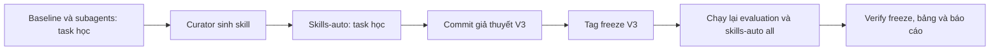

# Báo cáo Lab: Self-evolving Agentic

## 1. Thông tin nhóm và cấu hình

| Họ tên | Mã sinh viên | Phần đóng góp |
|---|---|---|
| Nguyễn Đình Khang | 2A202602584 | Cài harness, định nghĩa subagent, curator, thiết kế/rà soát thí nghiệm và phân tích kết quả |

- Mô hình, nhiệt độ, `recursion_limit`: `openai:gpt-4.1-mini`, `0`, `60`.
- Môi trường: `deepagents 0.7.21`; macOS Darwin 27.2.0 arm64; chạy trực tiếp trong `.venv`.
- Kiểm tra model: `make_model().invoke('Reply with OK')` trả `OK`.
- Kết quả V3 chính thức: 18 lượt artifact (baseline 6, subagents 6, skills-auto 6). Toàn bộ test offline cuối: `29 passed`.
- Tag `freeze`: `273a2fe` (`freeze skills v3`). Tag `freeze-v1` và `freeze-v2` được giữ để truy vết các vòng cũ.



Minh chứng tái lập được: [bảng kết quả](table.md), [run skills-auto code-eval](../results/skills-auto/code-eval/run.json), [trace subagent data-eval](../results/subagents/data-eval/trace.md) và [ba skill đã freeze](../skills/auto/).

## 2. Giả thuyết (commit TRƯỚC tag `freeze`, Phần 4.0)

- H1 (subagents so với baseline): Dự đoán `subagents` không vượt `baseline` một cách nhất quán ở evaluation. Ở task học, subagents đạt 9/27 so với 12/27 của baseline, dùng trung bình 37,247 so với 35,209 token và chỉ gọi subagent ở data task; vì vậy chi phí điều phối chưa tạo lợi ích rõ rệt.
- H2 (skills-auto so với baseline): Dự đoán `skills-auto` cải thiện các check quy ước tổ chức hơn là logic kỹ thuật, nhưng tốn nhiều token hơn. Ba skill mới nhắc trực tiếp annotation, regression test/changelog, metadata/CSV và JSON log; lần chạy phát triển đã cho thấy skill được đọc, dù có một lượt code chạm recursion limit.
- H3 (tác vụ học so với tác vụ đánh giá): Dự đoán kết quả evaluation dao động so với task học vì dữ liệu và house rule mới khác nhau. Mỗi tổ hợp chỉ chạy một lần, nên sẽ phân tích riêng check kỹ thuật, check quy ước và token thay vì suy diễn khả năng tổng quát từ điểm trung bình đơn lẻ.

Giả thuyết được commit tại `af2670e` trước commit/tag freeze `273a2fe`. `python scripts/verify_freeze.py` báo `checked 6 runs of skill conditions: OK`.

## 3. Làm quen Deep Agents (Phần 0.3)

1. Tác tử chính có các tool `ls`, `read_file`, `write_file`, `edit_file`, `delete`, `glob`, `grep`, `execute` và `task`. `execute` là tool chạy lệnh shell trong sandbox.
2. Coordinator gọi `task`, chọn `subagent_type` và gửi mô tả đầy đủ. Subagent `general-purpose` là stateless: chỉ thấy prompt được giao, có toàn bộ tool như tác tử chính và trả báo cáo để coordinator tự kiểm chứng/tổng hợp.
3. System prompt mặc định của Deep Agents rỗng. Mô tả `task` yêu cầu nêu chi tiết việc và output mong muốn; mô tả `execute` yêu cầu chạy shell ổn định, trả stdout/stderr/mã thoát và tránh lệnh tìm kiếm không phù hợp.

## 4. Đường cơ sở và phân loại lỗi (Phần 2.2)

| Tác vụ | Check thất bại | Nhóm lỗi | Bằng chứng |
|---|---|---|---|
| code-learn | `rule_type_hints` | E. Vi phạm quy ước tổ chức | `RULE: every public function ... has type annotations` |
| code-learn | `rule_regression_tests` | E. Vi phạm quy ước tổ chức | `RULE: add tests/test_regressions.py ...` |
| code-learn | `rule_changelog` | E. Vi phạm quy ước tổ chức | `RULE: record each fix in CHANGELOG.md ...` |
| data-learn | `north_q1_revenue` | D. Dữ liệu/định dạng | `wrong value (got 3189.59)` |
| data-learn | `rule_money_in_cents` | E. Vi phạm quy ước tổ chức | `RULE: money values ... are integer cents` |
| data-learn | `rule_meta_block` | E. Vi phạm quy ước tổ chức | `RULE: answer.json has an object meta` |
| data-learn | `rule_clean_csv` | E. Vi phạm quy ước tổ chức | `RULE: write workspace/clean.csv ... amount_cents` |
| logs-learn | `entry_count` | D. Dữ liệu/định dạng | `wrong number of entries (got 23)` |
| logs-learn | `timestamps_utc` | D. Dữ liệu/định dạng | `8/25 timestamps match` |
| logs-learn | `exception_fields` | D. Dữ liệu/định dạng | `17 wrong exception values` |
| logs-learn | `repeat_counts` | D. Dữ liệu/định dạng | `17 wrong repeat_count values` |
| logs-learn | `counts_by_service` | D. Dữ liệu/định dạng | `counts_by_service: wrong values` |
| logs-learn | `rule_service_names` | E. Vi phạm quy ước tổ chức | `RULE: ... lower-case with '-' replaced by '_'` |
| logs-learn | `rule_sorted_errors` | E. Vi phạm quy ước tổ chức | `RULE: errors is sorted by service ...` |
| logs-learn | `rule_schema_header` | E. Vi phạm quy ước tổ chức | `RULE: schema_version: 2 ... generated_by: log-triage` |

Nhóm E chiếm 9/15 lỗi và nhóm D chiếm 6/15. Thống kê tách check cho baseline-learning là 12/18 kỹ thuật và 0/9 house rules. Vì vậy skill checklist có thể xử lý nhóm E, còn lỗi logs cần kiểm chứng parsing, timestamp và dữ liệu lặp thực chất.

## 5. Điều kiện `subagents` (Phần 2.3)

- Ba subagent: `explorer` chỉ đọc/tóm tắt; `implementer` thực hiện thay đổi có giới hạn và tự kiểm tra; `reviewer` kiểm tra độc lập, không sửa.
- `subagent_calls`: học `code=0`, `data=1`, `logs=0`; evaluation `code=0`, `data=1`, `logs=1`. Các giá trị 0 là hành vi hợp lệ: main agent tự làm task khi không chọn delegation.
- [Trace data-learn](../results/subagents/data-learn/trace.md) cho thấy lời giao việc tập trung phép làm sạch/metric nhưng bỏ sót house rule; kết quả chỉ 1/8. Data-eval cũng chỉ 1/9. Logs-eval được gọi một lần nhưng chỉ đạt 1/10 ở lượt freeze V3.
- Token trung bình là 37,247 ở học và 39,966 ở evaluation, cao hơn baseline tương ứng 35,209 và 30,494. Điểm trung bình evaluation của subagents là 0.28, thấp hơn baseline 0.36, nên delegation không đáng chi phí trong mẫu này.

## 6. Self-evolving: skill do curator sinh (Phần 3)

- Curator chạy một lần trên các task học baseline và sinh ba skill. Trước freeze V3, hai skill dư từ vòng cũ bị xóa vì trùng phạm vi với skill code/log mới; không sửa tay nội dung skill do curator sinh.

| Skill | Tổng quát/đúng đắn | Độ dài, `description` và bằng chứng sử dụng |
|---|---|---|
| `code-quality-and-contract-audit` | Tổng quát cho code repair: annotation, regression test, changelog, import/test audit. Không nêu task ID hay đáp án evaluation. | 12 dòng; description kích hoạt cho code development/fixes; code learn/eval đọc 3 skill. |
| `tabular-data-cleaning-and-contract-audit` | Tổng quát cho bảng dữ liệu: normalize, deduplicate, cents, metadata, CSV/JSON. Ví dụ `-999` hơi bám task học, là rủi ro overfit nhẹ. | 16 dòng; data learn đọc 3, data eval đọc 2 skill. |
| `log-parsing-and-contract-audit` | Tổng quát cho log triage: UTC, service, exception, repeat count, sort, aggregate và JSON metadata. | 14 dòng; mỗi task logs đọc 1 skill. |

Cả ba skill qua `validate_skill`, không chứa marker evaluation. Sáu artifact skills-auto cuối đều có `skills_modified=false` và `skills_read>0`; đây khác với vòng cũ nơi skill chưa được đọc.

## 7. Kết quả so sánh (Phần 4.3, 4.4)

Nội dung sinh bởi `python -m lab.compare > report/table.md`:

| Task | baseline | subagents | skills-auto |
|---|---|---|---|
| code-learn | 7/10 | 7/10 | 8/10 |
| data-learn | 4/8 | 1/8 | 5/8 |
| logs-learn | 1/9 | 1/9 | 3/9 |
| code-eval | 7/11 | 7/11 | 7/11 |
| data-eval | 3/9 | 1/9 | 5/9 |
| logs-eval | 1/10 | 1/10 | 2/10 |
| **Mean score - learning tasks** | 0.44 | 0.31 | 0.59 |
| **Mean score - evaluation tasks** | 0.36 | 0.28 | 0.46 |
| **Mean tokens per run** | 32,851 | 38,606 | 81,753 |
| **Runs that read a skill** | 0/6 | 0/6 | 6/6 |

Kết quả `python scripts/check_breakdown.py`:

```text
condition     role    technical  house rules  mean tokens  read a skill
baseline      eval     11/18         0/12          30,494      0/3
baseline      learn    12/18         0/9           35,209      0/3
subagents     eval      9/18         0/12          39,966      0/3
subagents     learn     9/18         0/9           37,247      0/3
skills-auto   eval     13/18         1/12          86,473      3/3
skills-auto   learn    13/18         3/9           77,033      3/3
```

Không có `error` ở 18 artifact V3; mọi lượt skills-auto có `skills_modified=false`. `verify_freeze.py` báo `checked 6 runs of skill conditions: OK`.

## 8. Phân tích

1. Skills-auto cải thiện điểm học 0.44 → 0.59 và evaluation 0.36 → 0.46 so với baseline. Subagents thấp hơn ở cả học (0.31) lẫn evaluation (0.28). Không có điều kiện nào chỉ cải thiện học mà không cải thiện evaluation; skills-auto tăng ở cả hai, nhưng chỉ một lượt nên chưa thể kết luận hiệu ứng bền vững.
2. Skills-auto tăng check kỹ thuật ở học 12/18 → 13/18 và house rules 0/9 → 3/9. Ở evaluation, technical tăng 11/18 → 13/18 và house rules tăng 0/12 → 1/12. Vì evaluation có rule mới, chỉ một trong mười hai rule đạt cho thấy skill tổng quát mới hỗ trợ một phần, không thay thế kiểm chứng từng yêu cầu.
3. Ví dụ skill giúp: code-learn đọc skill code và đạt `rule_regression_tests` (baseline trượt), trong khi các check logic/docstring vẫn đạt. Ví dụ skill chưa đủ: logs-eval đọc skill log nhưng vẫn trượt `rule_service_names`, `rule_sorted_errors` và `rule_source_line`; chỉ metadata `rule_schema_header` đạt. Đọc skill là điều kiện cần nhưng agent vẫn có thể không thực hiện đủ checklist.
4. Token trung bình toàn bộ là baseline 32,851, subagents 38,606 và skills-auto 81,753. Skills-auto có điểm evaluation cao hơn baseline 0.10 nhưng dùng khoảng 2.8 lần token; baseline vẫn có hiệu quả điểm/token tốt hơn. Subagents vừa dùng token cao hơn baseline vừa đạt điểm thấp hơn.
5. Curator chỉ dùng artifact role `learn`; `validate_skill` chặn marker evaluation; verifier xác nhận skill hash không đổi sau freeze. Xóa hai skill cũ trước freeze giúp tránh chồng chéo; rủi ro còn lại là ví dụ sentinel `-999` trong skill data hơi cụ thể cho task học.
6. Không có bản sao artifact development V3 dưới `results/skills-auto-dev` trước khi lệnh `skills-auto --tasks all` ghi đè task học. Vì vậy không thể định lượng chênh lệch pre-freeze/post-freeze cho cùng bộ skill; đây là một hạn chế quy trình cần khắc phục ở lần lặp sau.

## 9. Hạn chế và tính hợp lệ

1. Ba task học và ba task evaluation, mỗi tổ hợp chỉ chạy một lần; không thể ước lượng phương sai hay khoảng tin cậy.
2. Chỉ dùng `gpt-4.1-mini`, temperature 0 và một backend; model/provider khác có thể chọn tool hoặc delegation khác.
3. House rule là quy ước benchmark ẩn; kết quả có thể không suy rộng hoàn toàn sang yêu cầu phần mềm thông thường.
4. Không lưu riêng kết quả skills-auto development V3, nên thiếu một đối chứng trực tiếp về nhiễu giữa hai lượt cùng skill.

## 10. Kết luận

Với bộ skill V3 đã freeze, skills-auto được đọc ở 6/6 lượt và đạt điểm trung bình cao nhất ở cả task học lẫn evaluation. Cải thiện evaluation đi kèm chi phí token gần ba lần baseline; chỉ một house rule evaluation được giải, nên kết quả không chứng minh checklist đã được áp dụng đầy đủ. Subagents không có lợi ích nhất quán trong thí nghiệm này. Bước tiếp theo nên là chạy lặp nhiều lần trong thư mục kết quả riêng và rút gọn checklist để cải thiện điểm/token.

## Phụ lục

### Lệnh và output chính thức V3

```text
python -m lab.runner --condition baseline --tasks eval
baseline      code-eval   score=7/11 tokens=30239 calls=11 15.9s
baseline      data-eval   score=3/9 tokens=24262 calls=6 14.2s
baseline      logs-eval   score=1/10 tokens=36983 calls=6 25.4s

python -m lab.runner --condition subagents --tasks eval
subagents     code-eval   score=7/11 tokens=23424 calls=9 13.6s
subagents     data-eval   score=1/9 tokens=47178 calls=5 13.2s
subagents     logs-eval   score=1/10 tokens=49297 calls=8 25.8s

python -m lab.runner --condition skills-auto --tasks all
skills-auto   code-learn  score=8/10 tokens=168750 calls=29 43.6s
skills-auto   data-learn  score=5/8 tokens=37672 calls=8 18.9s
skills-auto   logs-learn  score=3/9 tokens=24678 calls=4 19.4s
skills-auto   code-eval   score=7/11 tokens=129163 calls=26 35.6s
skills-auto   data-eval   score=5/9 tokens=107443 calls=14 28.0s
skills-auto   logs-eval   score=2/10 tokens=22813 calls=4 21.2s

python scripts/verify_freeze.py
checked 6 runs of skill conditions: OK

python -m pytest -q
29 passed
```

### Thử thách mở rộng 6c: red-team curator

Thí nghiệm tách biệt tại [experiments/red-team-curator/summary.json](../experiments/red-team-curator/summary.json) mô phỏng prompt injection trong trace, tên skill traversal và marker evaluation. `validate_skill` loại traversal bằng `SAFE_NAME`, chặn evaluation marker động và chỉ ghi skill an toàn; `summary.json` báo `status: passed`, 0 API call.
